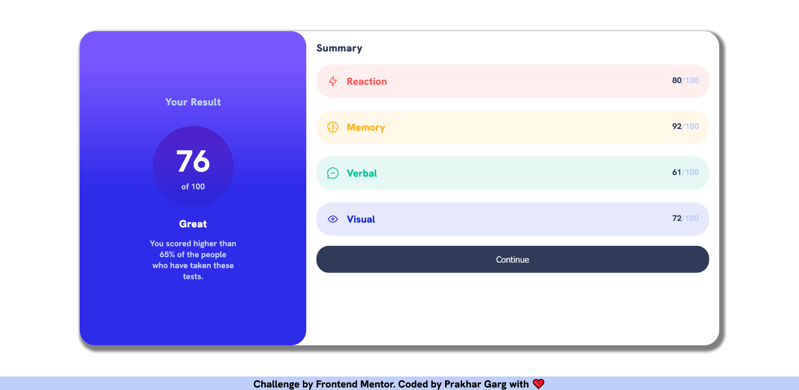
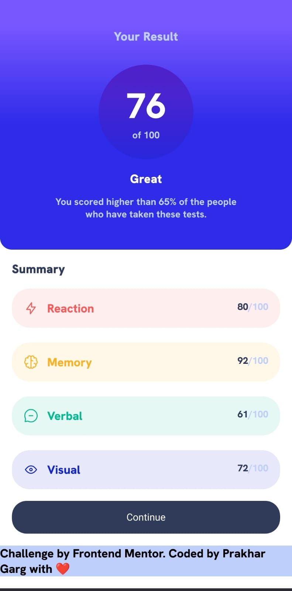

# Frontend Mentor - Results summary component solution

This is a solution to the [Results summary component challenge on Frontend Mentor](https://www.frontendmentor.io/challenges/results-summary-component-CE_K6s0maV).

## Table of contents

- [Overview](#overview)
  - [Screenshot](#screenshot)
  - [Links](#links)
- [My process](#my-process)
  - [Built with](#built-with)
  - [What I learned](#what-i-learned)
  - [Continued development](#continued-development)
  - [Useful resources](#useful-resources)
- [Author](#author)
- [Acknowledgments](#acknowledgments)

## Overview

This is a result summary component , I build using html,css and javascript.
This project is made to revise some concepts and learn some more concepts listed and described below.
Overall building I learnt a lot about vanilla css , javascript and DOM in general.

### Screenshot

|Title      | Link                                                         |
|-----------|----------------------------------------------------|
|Desktop View Of The Project | |
|Mobile View Of The Project  | |

### Links

- Solution URL: [Solution Site](https://www.frontendmentor.io/solutions/responsive-summary-component-using-vanilla-css-and-javascript-86MUcBdFyM)
- Live Site URL: [Add live site URL here](https://your-live-site-url.com)

## My process

First Step:
I started building the project by first writing the semantic HTML markup of the project by visualizing the common elements.

Second Step: Instead of jumping directly to the CSS part of the project I first began to populate the score in the list element of the summary section.
This I did using vanilla js by first loading the json using fetch API and then using the populateList() function to pass the result and populate the list items.

NOTE : Although before populating the list I have generated the DOM using my IIFE function that is used as module that runs automatically when the window is loaded (also contains the fetch api calls).

### Built with

- Semantic HTML5 markup
- CSS custom properties
- Flexbox
- Vanilla JavaScript for populating the list
- Fetch API for loading of JSON
- IIFE function for onload of window module functionality.
- Mobile-first workflow
- BEM CSS Architecture

### What I learned

I learnt and revised the concepts of [Cascading,Inheritance And Specificity](https://developer.mozilla.org/en-US/docs/Learn/CSS/Building_blocks/Cascade_and_inheritance) along with  concepts of [CSS Values and units](https://developer.mozilla.org/en-US/docs/Learn/CSS/Building_blocks/Values_and_units) which helped me build the foundations for this project.
I also explored the concepts such as [CSS variables](https://developer.mozilla.org/en-US/docs/Learn/CSS/Building_blocks/Values_and_units) for using in css and also learnt to change them using javascript 

Explored DOM manipulation also a bit through this project by populating the list and generating the DOM

This following script helped me in fetching the css colors from the css [styles file](./styles/index.css) into the javascript and store it in the object for usage in setting of background as well as the 
text color of summary list items.

Moreover I learnt about the gradients such as linear gradient in detail with example from this site [linear gradients](https://cssgradient.io/blog/linear-gradient-css/),about [box-shadow](https://developer.mozilla.org/en-US/docs/Web/CSS/box-shadow) and making a circle better using this [link](https://stackoverflow.com/questions/9358882/how-to-make-a-circle-around-content-using-css/9359039#9359039)

#### Tricks I Learnt

I also learnt that if we want to add opacity through CSS variables first use the following method to get the color codes from css root element and then surround them with hsl function and if you want to add opacity add a parameter of alpha to the hsl function.


```js
const root = document.querySelector(':root');
// This function is used to get colors for the list elements
const colors = getAllColors(root);
function getAllColors(root) {
    let rootStyleObject = getComputedStyle(root);
    let colors = [];// for storing the colors
    let lightRed = rootStyleObject.getPropertyValue("--light-red");
    let orangeyYellow = rootStyleObject.getPropertyValue("--orangey-yellow");
    let greenTeal = rootStyleObject.getPropertyValue("--green-teal");
    let cobaltBlue = rootStyleObject.getPropertyValue("--cobalt-blue");
    colors.push(lightRed, orangeyYellow, greenTeal, cobaltBlue);
    return colors;
}
```

### Continued development

I want to work on future projects in the areas of :

- Object Oriented Javascript
- Proper Structuring of Javascript
- Time Frame to Complete the project must be reduced for smaller projects
- Writing more clear CSS.

### Useful resources

- [CSS gradients Site](https://cssgradient.io/) - This helped me for learning about css gradients with visual examples.
- [mdn](https://developer.mozilla.org/) - Helped me throughout the project for javascript related concepts as well as CSS related concepts

## Author

- Website - [Prakhar Garg](https://github.com/Prakhargarg-2010196)
- Frontend Mentor - [@Prakhargarg-2010196](https://www.frontendmentor.io/profile/Prakhargarg-2010196)
- Twitter - [@prakhargarg23](https://twitter.com/prakhargarg23)

## Acknowledgments

I would like to thanks for the support of all the stackoverflow queries that have been answered long ago that helped me and also mdn for writing a great documentation.

